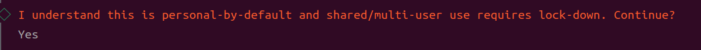
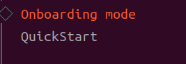
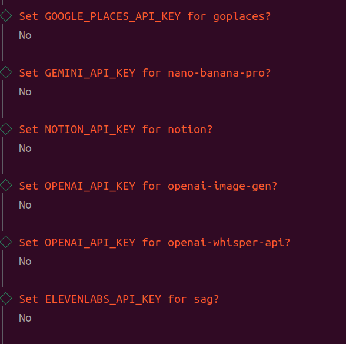
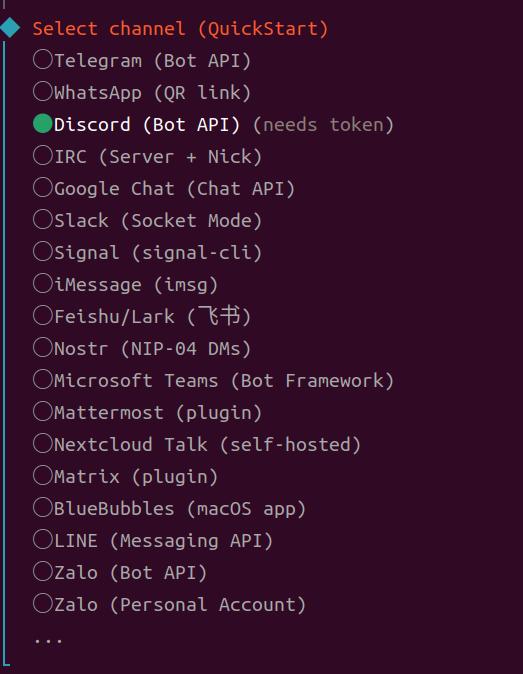
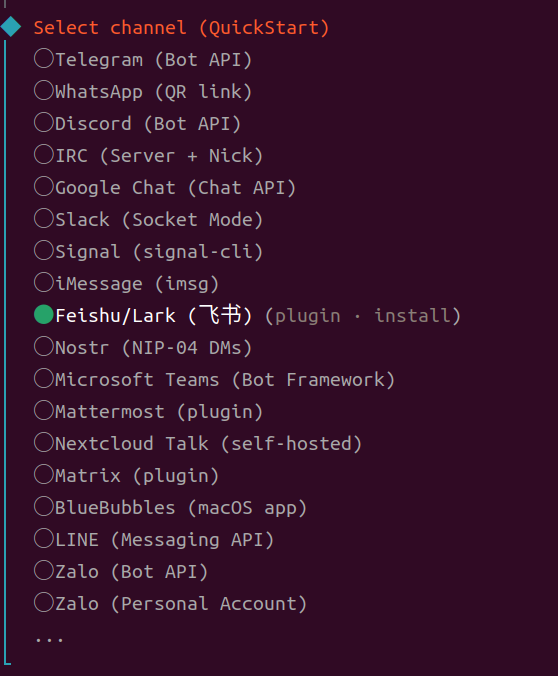
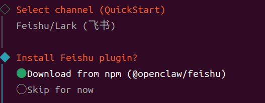
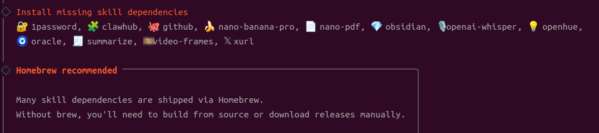
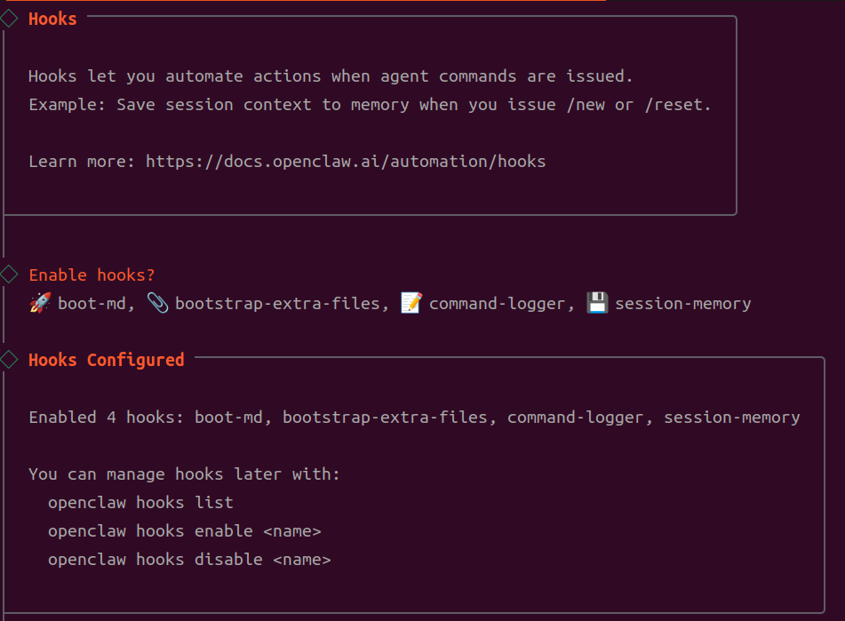
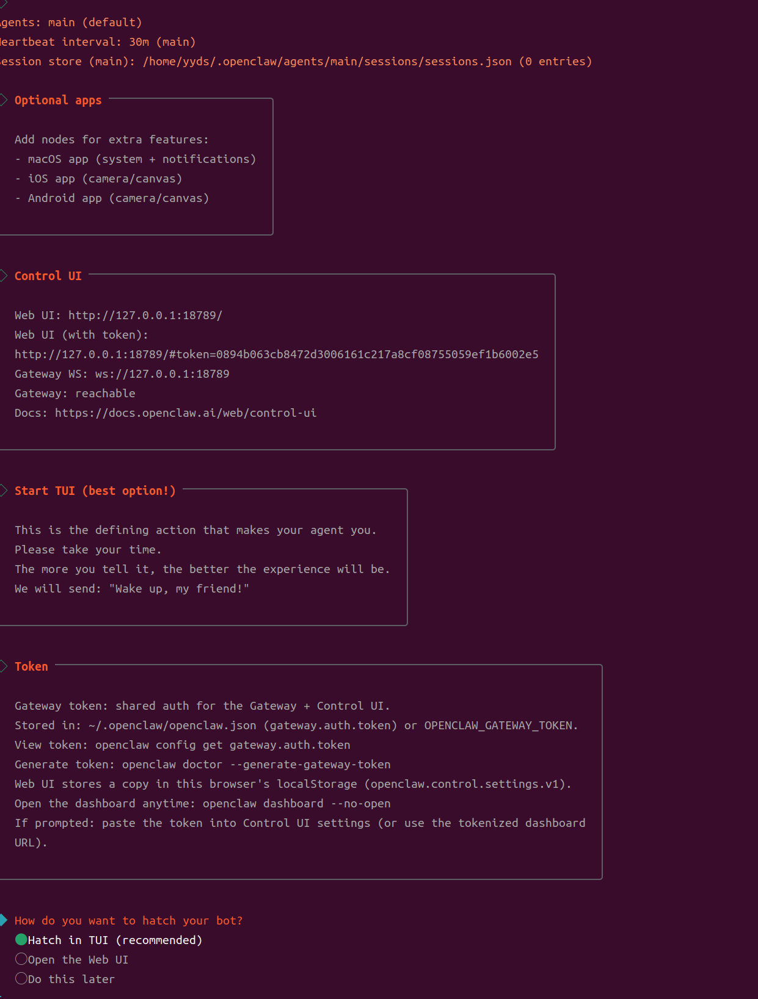

[Toc]

# openclaw
OpenClaw 是一款开源的 AI 个人助手，运行在你自己的机器上，通过聊天应用（Slack、Telegram、WhatsApp、Discord 等）或 Web 控制面板与之交互。它能帮你处理邮件、管理日历、写代码、控制智能家居、抓取网页数据等——就像一个 24 小时在线的私人助理。

官网：https://openclaw.ai/
GitHub：https://github.com/openclaw/openclaw
官方文档：https://docs.openclaw.ai/zh-CN/

## 一、安装与配置（从零到可用）
整个过程分 3 步：安装 OpenClaw → 运行 onboard 向导（配置 AI 模型 + 聊天渠道 + 技能 + Gateway）→ 开始使用。

### 第 1 步：安装 OpenClaw
```bash
npm install -g openclaw
```
验证安装：
```
openclaw --version
```
看到版本号即安装成功。
### 
optional(其他安装方式)
如果 npm 安装不适合你，还有以下替代方式：

官方安装脚本（一键安装）：

macOS / Linux：
```
curl -fsSL https://openclaw.ai/install.sh | bash
```
Windows PowerShell：
```
iwr -useb https://openclaw.ai/install.ps1 | iex
```
从源码安装（适合开发者）：
```
git clone https://github.com/openclaw/openclaw.git
cd openclaw
pnpm install
pnpm build
```

#### 第 2 步：运行初始化向导
```
openclaw onboard
```
向导会交互式引导你完成所有配置，包括：AI 模型、聊天渠道、技能、Hooks、Gateway 服务安装等。
#### 2.1 安全提示
首先会显示安全警告，阅读后选择 Yes 继续

#### 2.2 选择 Onboarding 模式
```
◇  Onboarding mode
│  QuickStart
```

选择 QuickStart（推荐），会自动配置网关端口（18789）、绑定地址（127.0.0.1）等默认设置。


#### 2.3 配置 AI 模型
选择 AI 模型提供商并输入 API Key：

#### 2.4 选择聊天渠道
向导会显示所有支持的聊天渠道状态，然后让你选择：
##### 1、slack
```
◇  Select channel (QuickStart)
│  Slack (Socket Mode)
```

选择你要配置的渠道。如果暂时不需要，可以跳过（后续通过 openclaw configure 补充）。

1.  配置 Slack 聊天渠道（可选）
选择 Slack 后，会提示你先去 Slack API 控制台创建 App 并获取 Token。以下是详细步骤：

##### 2、Feishu/Lark (飞书)





1) Go to Feishu Open Platform (open.feishu.cn)                                   │
2) Create a self-built app                                                       │
3) Get App ID and App Secret from Credentials page                               │
4) Enable required permissions: im:message, im:chat, contact:user.base:readonly  │
5) Publish the app or add it to a test group                                     │
Tip: you can also set FEISHU_APP_ID / FEISHU_APP_SECRET env vars.                │
Docs: feishu   

参考：https://cloud.tencent.com/developer/article/2626160

```
App ID： cli_a937f9afa078dbd6
App Secret：6LC8wY14b7YQU2xRPN5YFh7LiiOKpel6
```
             

#### 2.5 配置技能（Skills）




这些 API Key 都是可选的，用于特定技能。没有的话全部选 No 跳过即可，后续可通过 openclaw configure 随时补充。
#### 2.6 配置 Hooks（自动化钩子）



建议全部启用（默认已全选），这三个 Hook 的作用：
| Hook | 作用 |
|---|---|
|boot-md|启动时加载引导信息|
|command-logger|记录命令日志|
|session-memory|保存会话上下文到记忆|


后续可通过以下命令管理 Hooks：
- openclaw hooks list — 查看所有 Hooks
- openclaw hooks enable <name> — 启用
- openclaw hooks disable <name> — 禁用
#### 2.7 安装 Gateway 服务
向导会自动完成以下操作（无需手动干预）：

Systemd 配置（仅 Linux）：启用 systemd lingering，防止退出登录后服务被终止
Gateway 服务安装：自动安装 systemd 服务，确保网关持续运行
```
◇  Systemd ─────────────────────────────╮
│                                       │
│  Enabled systemd lingering for root.  │
│                                       │
├───────────────────────────────────────╯
│
◇  Gateway service installed.
```
安装完成后，向导会自动验证 Slack 连接：


1. **Control UI 信息**
2. Web 控制面板的访问地址：
```
 Web UI: http://127.0.0.1:18789/                                                 │
│  Web UI (with token):                                                            │
│  http://127.0.0.1:18789/#token=0894b063cb8472d3006161c217a8cf08755059ef1b6002e5  │
│  Gateway WS: ws://127.0.0.1:18789                                                │
│  Gateway: reachable                                                              │
│  Docs: https://docs.openclaw.ai/web/control-ui 
```
记住这个地址，后续可以通过浏览器访问 Web 控制面板与 Bot 对话。 也可以随时运行 openclaw dashboard 打开
2. **Bot（Hatch）**
这是 onboard 的最后一步，选择如何首次启动你的 Bot：

|选项 |	说明|
|---|---|
|Hatch in TUI (recommended) ✅|	直接在终端进入交互式 TUI 界面，与 Bot 对话并设定人设。推荐选这个。|
|Open the Web UI|	打开浏览器 Web 控制面板完成初始化|
|Do this later|	跳过，以后再做|

选择 Hatch in TUI 后，会自动进入终端聊天界面：
```
openclaw tui - ws://127.0.0.1:18789 - agent main - session main

 Wake up, my friend!
```
Bot 会发送 “Wake up, my friend!” 作为第一条消息。你可以开始和它对话，告诉它你的需求和偏好——描述越详细，后续体验越好。
```
退出 TUI：按 Ctrl+C 即可退出。Bot 的 Gateway 服务仍在后台运行。
``
